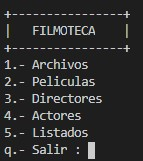
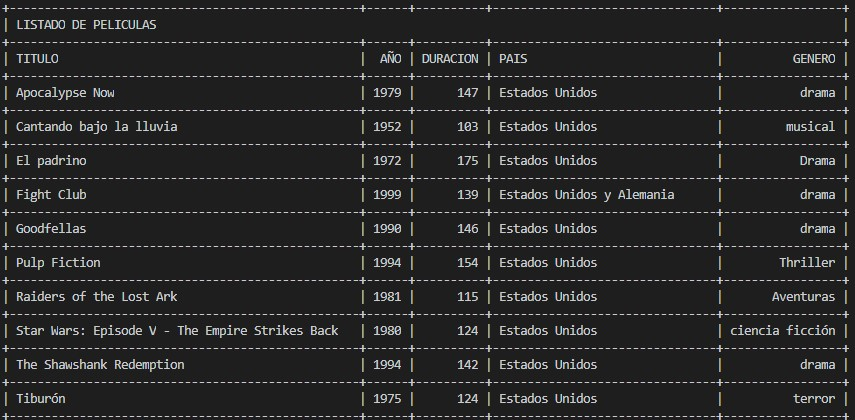

# Filmoteca

- Proyecto realizado en Diciembre 2018 
- Para la asignatura Programación III de Ingeniería Informatica de la Universidad de Salamanca

## Descripción
- Aplicacion para controlar una base de datos de peliculas
- De cada pelicula se guardan datos como el año, duración, director(es), reparto o la sinopsis, entre otros.
- De cada director se guardan datos como el nombre, la nacionalidad o las peliculas.
- De cada actor se guardan datos como el nombre, las peliculas o el año de debut.

## Funcionalidad
- Arranque
  - En el momento del arranque, el programa comprueba si existe algún fichero binario en la carpeta del escritorio (~/Desktop/Filmot18/), pueden estar películas.bin, actores.bin y directores.bin; si existe, alguno de ellos, los lee. Si no existe alguno, se importa el fichero de texto alternativo con formato delimitado por almohadillas (#), puede ser películas.txt, actores.txt o directores.txt.
  
- Salida del programa
  - La aplicación guarda con formato binario los archivos películas.bin, actores.bin y directores.bin, escribiéndolos con formato binario en la carpeta Filmot18 del escritorio.
  
- Opcion Archivos: El programa permite:
  - Exportar directores a un archivo llamado directores.col, con formato de columnas.
  - Exportar películas a un archivo llamado películas.html, con formato de tabla. 
  - Los archivos se escribe en la carpeta Filmot18 del escritorio.
  
- Opcion Peliculas: El programa permite efectuar las siguientes operaciones con películas:
  - Altas: Añadir una película a la colección de películas, además habrá que añadir el título a la colección de títulos de su director y a la colección de títulos de sus actores. 
  - Bajas: Borrar una película de la colección de películas, además habrá que quitar el nombre de la película de las colecciones de películas de directores y actores.
  - Modificaciones: Cambiar cualquiera de los atributos de una película, excepto su título y la colección de actores y directores.
  - Consulta: Se pedirá el título de la película por teclado y se mostrarán todos sus datos.
  
- Opcion Directores: 
  - Altas: Añadir un director a la colección de directores, se añadirán también los títulos de sus películas.
  - Bajas: Borrar un director de la colección de directores, no se permitirá borrar si alguna de sus películas está dada de alta en la colección de películas. Se indicará mediante un mensaje las películas que todavía tiene dadas de alta.
  - Modificaciones: Cambiar cualquiera de los atributos del director, excepto su nombre y la colección de películas.
  
- Opcion Actores:
  - Altas: Añadir un actor a la colección de actores, se añadirán también los títulos de sus películas.
  - Bajas: Borrar un actor de la colección de actores, no se permitirá borrar si alguna de sus películas está dada de alta en la colección de películas. Se indicará mediante un mensaje las películas que todavía tiene dadas de alta.
  - Modificaciones: Cambiar cualquiera de los atributos del actor, excepto su nombre y la colección de películas.
  - Películas de un actor: Sacará un listado por pantalla, en forma de tabla ordenada por año, de las películas interpretadas por un actor cuyo nombre se pedirá por teclado. 
  
- Opcion Listado:
  - Imprime la relación de películas ordenado alfabéticamente por nombre. 
  - Imprime la relación de directores ordenada por nacionalidad y año de nacimiento. 
  - Imprime la relación de actores ordenada por año de debut y nombre. 
  

